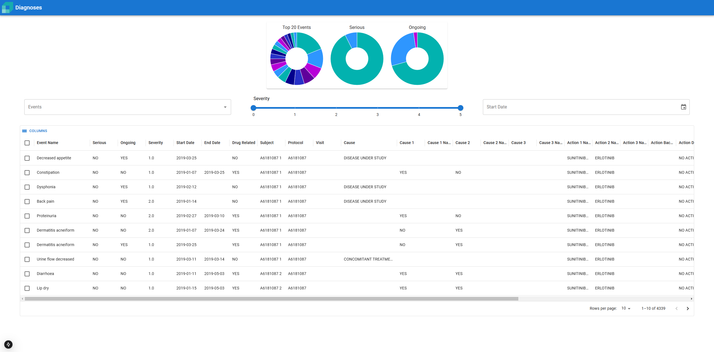

# Cornerstone Take Home Assignment



## Getting Started

First, install the dependencies:

```bash
yarn
```

Next, run the development server:

```bash
yarn dev
```

Open [http://localhost:3000](http://localhost:3000) with your browser to see the result.

## Todo

- [x] Setup Next.js
- [x] Load csv into data store
- [x] Create /api/v1/diagnoses/summary endpoint
- [x] Add App bar to top of page
- [x] Add graphs for Summary component and hook up
- [x] Add DiagnosisTable component with Data Grid
- [x] Add searchStore method to data store
- [x] Add pagination to DiagnosisTable
- [x] Add filters to DiagnosisTable
- [x] Setup load state for filters
- [x] Turn on edit functionality for Data Grid
- [x] Add updateStore method to data store
- [x] Hook up Data Grid cell editing to data store
- [x] Add flag state for each row in data store
- [x] Add column for selecting rows
- [x] Change row color based on flag state
- [x] Create custom toolbar buttons for flagging rows

## Nice to have

- Filters also affect graphs
- Columns are sortable
- Data Grid should still show a loading state on initial load
- Pick better colors for graphs
- Setup a theme palette
- Light/dark mode
- Editing data should refresh filters
- Edit validation
- Bulk update
